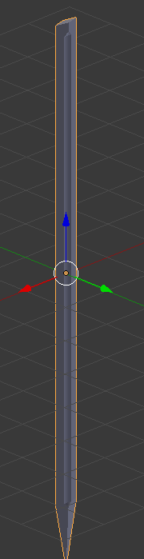
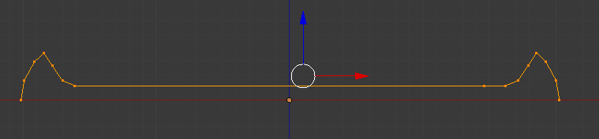
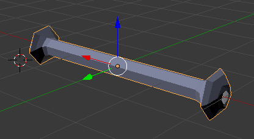
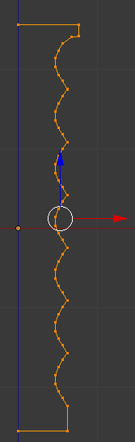
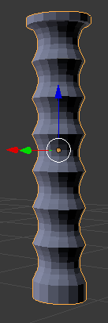
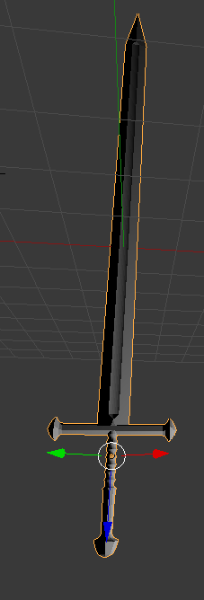

# Diario de la práctica 1
## 26/02/17
Hasta ahora he hecho alguna cosa inicial creando el filo de la espada partiendo de un cubo y moviéndole dos aristas opuestas hacia dentro para crear una forma de filo. Tras esto se hace una extrusión de las caras para hacerlo más alargado utilizando la transformación elemental _Mover_ para realizar la extrusión en el eje de la X solo.

Como se puede ver en las imágenes de Narsil las aristas no cortantes del filo están "comidas" hacia dentro formando un arco, para hacer esto a partir de un cilindro con centro esa arista hay que eliminarlo quedándome con el resto lo que me daría esa forma circular hacia dentro. Solo falta descubrir como hacer esto último. Parece que he logrado hacer algo parecido usando la operación biselado _Bebel_ del submenú _Edges_ del menú _Mesh_ (Ctrl+E), como parámetros le he dado offset 0.26, 5 segments y profile 0.150

## 27/02/17

Me he percatado de que las bases de filo no son planas así que he creado un nuevo cubo al que le he movido 2 aristas opuestas de la posición 1,1,0 a la 0.25,0.25,0 y lo mismo en negativo con la otra arista, tras esto he aplicado una extrusión. Como se ve en la imagen el biselado de esas aristas aplanadas no llega hasta el final del filo, si no que cerca del final desaparece y las aristas que no se han modificado se van uniendo hasta acabar en punta. Por ello hay que distinguir la región donde aparece el biselado y la de la punta, para hacer esto he utilizado la operación cortar y deslizar para cortar el objeto a la mitad por un plano perpendicular y aplicado el biselado a las 2 aristas estrechadas de la parte inferior, como parámetros de este biselado offset de 0.5, 8 segmentos y perfil de 0.150.

Tras esto voy a intentar hacer la punta, para ello he alargado la sección superior no biselada desde Z = 0.9 a Z = 7.47 y prodeceré a acercar los vértices superiores de las aristas opuestas no modificadas previamente de la posición 1,-1,7.47 a la 0,0,7.47 y lo mismo con los otros 2 vértices superiores.

Para desarrollar la espada hay que hacer una extrusión de la sección biselada en el eje z de 24 unidades aprox. me he dado cuenta que igual que la punta no tiene sección biselada tampoco la base por ello cuando divido el cubo en 2 secciones perpendiculares debería hacerlo en 3, crear la punta en la superior, la zona biselada en la intermedia y la zona de la base en la inferior. Usando la operación cortar y deslizar sobre un nuevo cubo lo divido en 3 secciones. y hago la punta en la superior con una altura de 8 unidades.

Para respetar las proporciones de la imagen si he hecho la punta de 8 unidades y ocupa como 1/6 de la espada es necesario que el filo (sección intermedia) sea de 48 unidades en el eje Z. Una vez hecho el filo he decido realizar un _Scale_ en todos los ejes con la tecla S para que tenga una longitud de 10 en el eje de las Z (no son las mismas unidades). El resultado de esto es el siguiente:

 

Para añadir la cruceta he pensado crear un cubo y luego deformarle las puntas pero no tengo muy claro como hacerlo, por ello he pensado en los perfiles de revolución, para ello me he servido de las indicaciones dadas en el guión de la práctica y del siguiente [tutorial](https://en.wikibooks.org/wiki/Blender_3D:_Noob_to_Pro/Creating_a_Simple_Hat). Siguiendo los pasos he creado el siguiente perfil de revolución en la capa 2:

 

Lo que usando la operación _Spin_ con todos los vértices seleccionados sobre el eje X con ángulo 360º y 6 caras genera el siguiente objeto:

  

Como se puede ver los extremos no se han cerrado seguramente por un pequeño desajuste en el centro de la operación Spin.

Hablando con compañeros parece que muchos han usado el [_Proportional Editing Mode_](https://en.wikibooks.org/wiki/Blender_3D:_Noob_to_Pro/Mesh_Edit_Mode#Proportional_Editing) que permite desplazar los vértices y que los de alrededor se adapten de manera más o menos orgánica/natural. Probablemente esto sirva para cerrar los extremos de la cruceta que habían quedado abiertos.

## 28/02/17

Voy a comenzar por cerrar los extremos de la cruceta que quedaron abiertos. He probado el _Proportional Editing Mode_ pero al arrastrar el resto de los vértices deforma la cruceta entera y eso no es lo deseado así que he movido los 6 vértices de cada lado cambiando sus coordenadas Z e Y a 0. Pero queda demasiado plano así que tras esto he alargado en el eje X estos vértices para que acabe más en punta.

Una vez contento con el resultado es necesario unir la cruceta al filo, para ello he seguido el siguiente [tutorial](https://en.wikibooks.org/wiki/Blender_3D:_Noob_to_Pro/Putting_Hat_on_Person). En lugar de establecer relación de parentesco he unido los objetos en uno solo con la operación join.

Para crear el pico que sale desde la cruceta hasta el filo he subdividido la arista que va desde el biselado del filo al final donde se une con la cruceta y en la subarista más cercana a la cruceta he creado un biselado de offset 1, 7 segmentos y perfil 1.

Para hacer la empuñadura he utilizado la técnica del perfil de revolución otra vez, una vez hecho uno de los 7 arcos he utilizado la operación _Duplicate_ para generar el resto respetando las mismas proporciones, el resultado es el siguiente perfil:

Usando la operación _Spin_ se genera el siguiente objeto:

Una vez acabada la empuñadura la paso a la capa 1 y la uno al objeto filo y cruceta ajustando el tamaño con la operación _Scale_.

Para hacer el pomo repito la técnica de generarlo por revolución y al acabarlo lo uno con lo que ya tenia ajustando el tamaño con la operación _Scale_ otra vez con lo que ya están todas las partes de la espada generadas y ensambladas. El resultado final se puede apreciar en la siguiente imagen:

