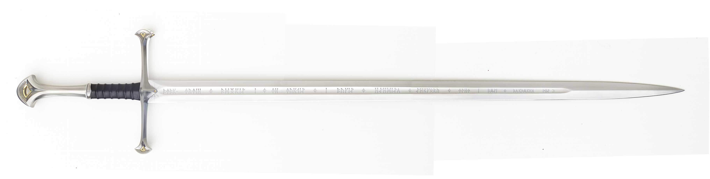
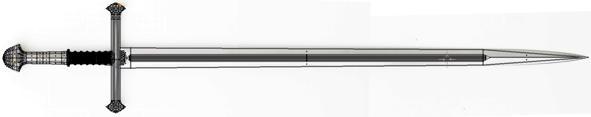
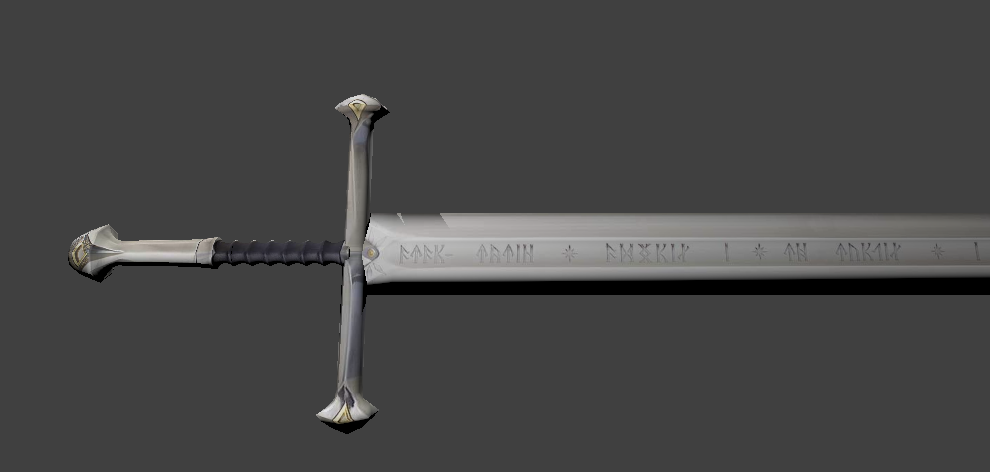

<h1 style="text-align: center;">Práctica 3</h1>

## Introducción
El objetivo de esta práctica es la aplicación de texturas a diversos objetos, para ello se han aplicado tres texturas a tres objetos distintos. Un modelo de la tierra a partir de una esfera, un modelo de un dado a partir de un cubo y un modelo propio.

Respecto a los dos primeros, teniendo en cuenta que en el guión de la práctica se explica paso por paso como aplicar las texturas he considerado que no merece la pena describir los pasos realizados en esta memoria. Por ello hablaré del tercer modelo.

## Selección de modelo
He decidido aplicar textura al modelo de mi primera práctica, una espada, en concreto Narsil, del Señor de los Anillos. Por ello lo adecuado sería utilizar como textura diversas fotos de esta. Tras una búsqueda por internet encontré una textura mejor que las fotografías usadas para crear el modelo en la primera práctica, ya que la imagen tenía mayor resolución y estaba mejor situada. En la siguiente imagen se puede apreciar la textura utilizada.

## Pasos seguidos para aplicar la textura
#### Cargar la imagen en Blender
Esta tarea se realiza al igual que se ha hecho para aplicar la textura en los modelos previos, es necesario crear una nueva ventana arrastrando desde la esquina superior derecha y en la nueva ventana cambiar el editor de _3D View_ a _UV/Image editor_, una vez allí cargar la imagen con _Image_ > _Open Image_.

#### Aplicar una proyección del modelo 3D sobre la textura
En los primeros modelos se usaron la proyección cilíndrica (estirar un cilindro) y la aplicación de una textura desplegada usando costuras.

La proyección cilíndrica no es directamente aplicable al no encontrarnos ante un modelo 3D esférico o cilíndrico. Respecto a la textura desplegada eso requeriría tener dicha textura y al no ser el caso habría que elaborarla lo que supondría un trabajo adicional que no aportaría mucho a los objetivos de la práctica. Por ello pensé que lo mejor sería aplicar una proyección plana.

Buscando entre las diversas opciones de Blender no encontré directamente una proyección plana, pero si que es posible realizar una proyección desde la vista actual del modelo, por ello coloqué el modelo en vista frontal ortogonal y lo sitúe como se aprecia en la fotografía de la textura (con el mango a la izquierda). Una vez allí pase al _Edit mode_ y realizo la proyección plana seleccionando _Mesh_ > _UV Unwrap_ > _Project from view_.

#### Ajustar las coordenadas de textura
La proyección realizada no coincide directamente con la fotografía (por ser un modelo no exacto), por ello usando transformaciones básicas (rotación, translación y escalado) voy situando los vértices para que cuadren con los límites de la imagen. En algunos puntos concretos no coincide aun así pero las coordenadas finales de textura se pueden apreciar en esta imagen

#### Asignar la textura al modelo
Para ello hay que pasar la vista de _3D View_ a modo objeto, añadirle un material desde la ventana de propiedades y marcar la opción de uso de textura _Face texture_. Para poder verla cambiamos el _Viewport shading_ o modo de visualización a _Rendered_ (habiendo seleccionado el motor de renderizado _Blender Render_).

<!-- Salto de página -->

## Resultado final
El modelo con la textura se puede apreciar en la siguiente imagen, como comentarios queda algo extraña los extremos de la cruceta y el pomo al haber sido generados por revolución de una manera no exacta no coincide con el modelo concreto de la espada.

