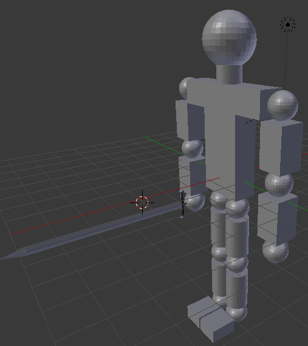

<h1 style="text-align: center;">Práctica 4</h1>

## Introducción
El objetivo de esta práctica es aprender a construir entornos interactivos con
Blender, para ello usaré el _Logic Editor_ junto con el motor de renderizado _Blender Game Engine_ (BGE). El entorno interactivo dispondrá de diversos movimientos en respuesta a eventos disparados por el usuario como el movimiento del ratón o la pulsación de una tecla.

## Selección del modelo
Este entorno interactivo debe estar creado entorno a un modelo o avatar, el cuál responda a las acciones del usuario, por ello he decidido elegir mi modelo de la práctica dos, el muñeco humanoide con la espada. En la siguiente imagen se puede observar el modelo elegido.

## Entorno interactivo
En este apartado iré mencionando los pasos llevados a cabo para crear las diversas interacciones, los sensores que las activan y los movimientos que producen en el avatar.

A modo general comentar que para observar el entorno virtual hay que entrar el modo _Play game_ con el motor de renderizado BGE seleccionado, esto se puede hacer pulsando la tecla P, además para desplegar el _Logic Editor_ es necesario crear una ventana (partiendo de la del _Timeline_ inferior por ejemplo) y seleccionar _Logic Editor_. En este apartado se presentan 3 columnas:
- Sensores: Detectan las condiciones y eventos.
- Controladores: Combinan las señales de los sensores para mandarlas a los actuadores que producen el movimientos
- Actuadores: Modifican el modelo o el sistema cambiando parámetros como la posición, rotación...

Hay que comentar también que durante la creación de este entorno virtual se encontraron diversos problemas debido a la jerarquía del modelo y es que diversas partes sufrían transformaciones no esperadas (los segmentos de una pierna se separaban al moverla). Por ello para asegurarse de que todo va según lo esperado es necesario aplicar las rotaciones y escalados actuales para que Blender las tome como valor inicial, para hacer esto seleccionamos un objeto y todos sus hijos (en mi caso todo el avatar) y seleccionamos _Object_ > _Apply_ > _Rotation & Scale_.

Además para aplicar movimiento a un objeto hay que cambiar su comportamiento a sólido rígido, por ello cambio el comportamiento de todo el avatar, esto se puede hacer desde la ventana _Properties_ en la pestaña _Physics_. Junto a esto será necesario cambiar la gravedad del mundo a 0 para que el objeto no se "caiga" hacia abajo, esto se realiza desde la ventana _Properties_ en la pestaña _World_.

### Movimiento pierna izquierda
El movimiento de la pierna izquierda se ha asignado a la articulación de la cadera izquierda para esto añado 2 sensores, actuadores y controladores para unirlos. Cada una de esta triada se encarga de mover la pierna hacia delante o hacia atrás.

Para el movimiento he decidido mover la pierna hacia delante y hacia atrás lo que se traduce en rotar la articulación sobre el eje Y, la aplicación del movimiento hacia delante la he llevado a cabo seleccionando un sensor de tipo _Keyboard_ (que se activa al pulsar una tecla) sobre la tecla **E**, como controlador uno de tipo _And_ y como actuador uno de tipo _Motion_ > _Simple Motion_ que aplica una rotación de -1º en el eje Y. El movimiento hacia detrás se ha hecho de igual forma pero con la tecla **D** y aplicando una rotación de 1º en el eje Y. En la siguiente imagen se puede apreciar la vista del _Logic Editor_ de la cadera izquierda.

### Movimiento pierna derecha
En este miembro se ha creado el mismo movimiento que en la pierna izquierda pero partiendo desde la cadera derecha. En este caso la tecla **W** para avanzar la pierna 1º en el eje Y y la tecla **S** para retrasarla la misma cantidad.

### Movimiento brazo izquierdo
Los brazos en general se moverán de igual modo que las piernas, rotando sobre el eje Y, pero haciéndolo sobre la articulación del hombro. Por ello para el brazo izquierdo he creado un sensor sobre la tecla **K** que mueve el brazo hacia delante rotandoló -1º en el eje Y, así como otro en la tecla **I** que realiza el movimiento inverso.

### Movimiento brazo derecho
Como resulta obvio, llegados a este punto, el brazo derecho realiza el mismo movimiento que el resto de las articulaciones, usando la tecla **L** para avanzar el brazo y la **O** para retrasarlo.

### Movimiento de todo el avatar
Según el guión de la práctica hay que controlar la cámara en segunda persona siguiendo el movimiento del avatar, pero hasta ahora los movimientos del avatar son de sus partes, el centro del modelo no se desplaza en ningún momento, por ello hay que aplicar algún movimiento más que desplace a todo el avatar.

Mi idea inicial fue simular el movimiento de una persona andando usando como base los movimientos de los miembros creados hasta ahora, por ello pensaba usar las **flechas de dirección** para que al pulsar hacia delante moviera las piernas y los brazos de manera alterna a la par que se desplazaba hacia delante. Esto parece ser muy complejo de realizar con el _Logic Editor_ por ello descarté esta opción y decidí simplemente deslizar el avatar por el plano. Teniendo en cuenta que el padre de toda la jerarquía del modelo es el **tronco** esté será el objeto sobre el que se apliquen todas las transformaciones que se comentarán a continuación.

Repitiendo el patron previo he creado cuatro triadas de sensor-controlador-actuador para cada una de las cuatro direcciones en las que se puede mover el avatar. El desplazamiento hacia **delante** se realiza con un sensor _Keyboard_ sobre la tecla **Up Arrow** lo que dispara un desplazamiento de 0,5 en el eje X, mientras que el movimiento opuesto se lleva a cabo con la tecla **Down Arrow**. He decidido que los movimientos hacia los lados sean rotaciones sobre el eje Z (sobre el avatar en sí), por ello el movimiento hacia la izquierda se realiza con la tecla **Left Arrow** y produce una rotación de -1º en el eje Z, así mismo para la derecha se lleva a cabo una rotación de 1º sobre el eje Z al pulsar la tecla **Right Arrow**.

Los actuadores empleados para estos movimientos se pueden ver en la siguiente imagen.

### Movimiento de la cámara
Para aplicar el movimiento de la cámara he decido seguir los pasos dados en el guión de la práctica, es decir hacer que la cámara tenga el tronco del avatar (padre de la jerarquía) como padre para que se le apliquen sus transformaciones y permitir mover la cámara libremente con un rango de -30º a 30º sobre los ejes X y Z. Para llevar a cabo esto último he creado un sensor _Delay_ con un retardo de 0,1, un controlador _And_ y un actuador de tipo _Mouse_, modo _Look_, límites sobre los ejes X e Y de -30º a 30º y asignar el eje Y al Z.

Para poder ver estos movimientos es necesario situarse en la perspectiva de la cámara antes de entrar en modo _Play game_ pulsando para ello la tecla **0** del numpad.

<!-- Salto de página -->

## Resultado final
Voy a recordar todos los movimientos implementados así como sus controles a modo de resumen del entorno virtual

<table>
  <thead>
    <tr>
      <th>Movimiento</th>
      <th class="control">Control</th>
    </tr>
  </thead>
  <tbody>
    <tr>
      <td>Mover todo el avatar hacia delante</td>
      <td class="control">Up Arrow</td>
    </tr>
    <tr>
      <td>Mover todo el avatar hacia detrás</td>
      <td class="control">Down Arrow</td>
    </tr>
    <tr>
      <td>Rotar el avatar hacia la derecha</td>
      <td class="control">Right Arrow</td>
    </tr>
    <tr>
      <td>Rotar el avatar hacia la izquierda</td>
      <td class="control">Left Arrow</td>
    </tr>
    <tr>
      <td>Mover la cámara</td>
      <td class="control">Ratón</td>
    </tr>
    <tr>
      <td>Mover la pierna derecha hacia delante</td>
      <td class="control">S</td>
    </tr>
    <tr>
      <td>Mover la pierna derecha hacia detrás</td>
      <td class="control">W</td>
    </tr>
    <tr>
      <td>Mover la pierna izquierda hacia delante</td>
      <td class="control">D</td>
    </tr>
    <tr>
      <td>Mover la pierna izquierda hacia detrás</td>
      <td class="control">E</td>
    </tr>
    <tr>
      <td>Mover el brazo derecho hacia delante</td>
      <td class="control">K</td>
    </tr>
    <tr>
      <td>Mover el brazo derecho hacia detrás</td>
      <td class="control">I</td>
    </tr>
    <tr>
      <td>Mover el brazo izquierdo hacia delante</td>
      <td class="control">L</td>
    </tr>
    <tr>
      <td>Mover el brazo izquierdo hacia delante</td>
      <td class="control">O</td>
    </tr>
  </tbody>
</table>

Como a diferencia de las otras prácticas, el resultado final no es un nuevo modelo si no un entorno interactivo con el modelo, en lugar de enseñar una imagen del modelo final aporto una pequeña demostración de funcionamiento en el fichero `Demo.ogv` adjunto a esta memoria.
