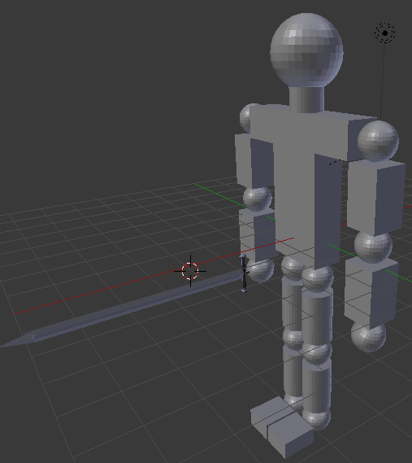
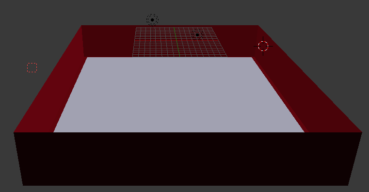
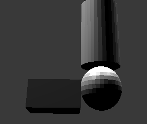
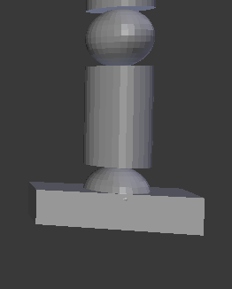
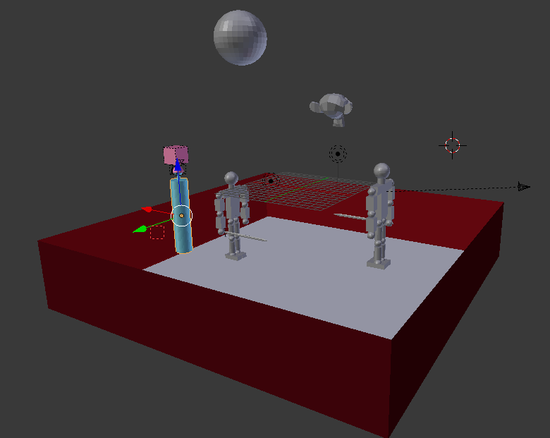

<h1 style="text-align: center;">Práctica 5</h1>

## Introducción
El objetivo de esta práctica es aprender a utilizar el motor de física de
Blender, para ello usaré el motor _Bullet_ para generar colisiones e interacciones entre objetos. Habrá que incluir diversos tipos de objetos así como, al menos, una restricción.

## Selección del modelo
Continuando con la práctica previa he decidido crear un modelo que incluya a mi personaje humanoide como actor móvil además de otros objetos para comprobar como funciona el motor de física

## Entorno interactivo

Antes de comenzar a comentar como he realizado mi entorno he intentado realizar otro:

Inicialmente tuve la idea de crear un escenario que simulara un castillo y meter algunos otros objetos. Para ello busque modelos de castillos para poder incorporarlos a mi entorno, encontrando un modelo de castillo bastante decente en formato `.obj` que fui capaz de importar en Blender pero al pasar ese modelo del castillo al modo juego parece que las normales no se han importado bien y no se dibuja adecuadamente.

Por ello pensé en crear una cuadrilátero similar al que podemos ver en un combate de boxeo. Para comprobar el funcionamiento del motor físico decidí inicialmente duplicar al humanoide creando un "contrincante", aunque este duplicado no se mueva. Más adelante decidí incluir otro par de objetos para comprobar los distintos tipos físicos, además otro objeto con una restricción de tipo _Ball_ que simula un saco de boxeo.

### Mundo
La creación de mi entorno me ha obligado a modificar algunas propiedades generales del mundo, para ello accediendo desde la ventana de _Properties_ a la pestaña _World_ he modificado:
- Lo primero es seleccionar el motor físico _Bullet_ con una gravedad como la terrestre (9.80).
- He tenido que modificar los _Physics Substeps_ ya que se daban comportamientos muy extraños como que objetos dinámicos atravesaran a estáticos cuando esto no debería pasar. Como contrapartida de mejorar la calidad de simulación al realizar más pasos esta se vuelve más lenta, en especial se nota cuando colisionan el humanoide actor y el contrincante.

### Cuadrilátero
Ha sido creado a partir de un plano, agrandado usando un _Scale_ en todos los ejes. Para crear las paredes o cuerdas del cuadrilátero he aplicado una extrusión de las aristas del este plano hacia arriba en el eje Z. Para darle un aspecto más de cuadrilátero le he aplicado una textura dándole un color rojo

Para finalizar he creado otro plano algo más pequeño que el anterior colocado en el interior del cuadrilátero para que se asemeje al suelo blanco característico. Una vez bien situado lo he unido al mismo objeto.

Respecto al comportamiento físico de este objeto teniendo en cuenta que será la base o el suelo del escenario lo he fijado como objeto _static_.

### Pelota
Otro de los objetos que he añadido es una pelota, como base he utilizado una _UV Sphere_ y básicamente es necesario modificar su comportamiento físico para que se comporte de forma elástica, como lo haría una pelota, por ello he fijado su tipo físico a _Soft Body_.

Para calcular sus límites de colisión o _collision bounds_ he seleccionado el típo _Convex Hull_ con un margen de 0.04 ya que en prácticas se comento que este tipo de límite se adapta al objeto totalmente y es más rápido de calcular que el tipo _Triangle Mesh_.

### Mono
He decidido incluir a Suzane, la mascota de Blender, que se encuentra como una primitiva llamada _Monkey_. Con este objeto pretendo experimentar como se comportan los objetos dinámicos, los cuales se mueven pero no giran.

Al igual que en el caso previo he aplicado los límites de colisión como _Convex Hull_ con un margen de 0.04.

### Saco de boxeo
Inspirándome en el ejemplo `constrains` disponible en prado decidí crear un saco de boxeo a partir de un cubo y una articulación con una restricción de tipo _Ball_ unida a un cilindro de tipo rígido. He aplicado los mismos colores disponibles en el mencionado ejemplo y he tenido que modificar el pivote para situarlo aproximadamente en el centro de la articulación.

### Contrincante
Como he comentado previamente he creado un duplicado del modelo que actuará como contrincante del humanoide que se moverá, para ello le he eliminado toda la interacción del motor de lógica ya que no debe moverse. Por este mismo motivo he decidido unir todas las partes del humanoide en una sola ya que así supongo que se aliviará el procesamiento de colisiones en este objeto. Respecto al tipo físico de objeto he utilizado _Rigid Body_.

Otra vez más he aplicado los mismos márgenes de colisión que en los casos previos.

He tenido que realizar una modificación en los pies del modelo, puesto que no aportan la suficiente estabilidad y este se cae al suelo al entrar en modo juego, en las siguientes imágenes se ve el pie previo a la izquierda y el píe modificado a la derecha.

### Actor
Esta ha sido sin duda la parte más complicada de todo el entorno, ya que ha de integrar el movimiento con el motor lógico y además se trata de un objeto jerárquico. Mi principal fuente de problemas ha sido que al aplicar el tipo _Rigid Body_, la casilla de actor y los bordes _Convex Hull_ a todas las partes se producían colisiones entre las partes del modelo lo que provocaba que al entrar en modo juego el modelo se moviera solo de manera extraña.

Para reducir estos choques decidí unir ciertas partes que no se mueven, uní en un solo objeto todos los elementos la pierna izquierda, de la derecha, lo mismo con los brazos y por último uní el cuello y la cabeza al tronco quedando por tanto el modelo formado por: tronco, pierna izquierda, pierna derecha, brazo izquierdo, brazo derecho. A pesar de esto seguía dando problemas, la solución la encontré gracias a mi profesor Juan Carlos Torres Cantero, que me comentó que debía de marcar en todas las partes del modelos que era un objeto compuesto usando la casilla _Compound_ del apartado _Collision Bounds_. Con esto el objeto ya se comporta como debería.

Probando el modelo ví que como es natural al producirse algún choque era posible que el modelo se cayera al suelo, tras lo que no es fácil volver a levantarlo, por ello decidí cambiar el tipo físico del tronco a _Dynamic_ ya que este le permite moverse y chocar pero no girar y al ser este objeto el padre de la jerarquía impide que el modelo pueda llegar a caerse.

## Resultado final
Voy a recordar todos los movimientos implementados en el actor así como sus controles a modo de resumen del entorno virtual

<table>
  <thead>
    <tr>
      <th>Movimiento</th>
      <th class="control">Control</th>
    </tr>
  </thead>
  <tbody>
    <tr>
      <td>Mover todo el avatar hacia delante</td>
      <td class="control">Up Arrow</td>
    </tr>
    <tr>
      <td>Mover todo el avatar hacia detrás</td>
      <td class="control">Down Arrow</td>
    </tr>
    <tr>
      <td>Rotar el avatar hacia la derecha</td>
      <td class="control">Right Arrow</td>
    </tr>
    <tr>
      <td>Rotar el avatar hacia la izquierda</td>
      <td class="control">Left Arrow</td>
    </tr>
    <tr>
      <td>Mover la cámara</td>
      <td class="control">Ratón</td>
    </tr>
    <tr>
      <td>Mover la pierna derecha hacia delante</td>
      <td class="control">S</td>
    </tr>
    <tr>
      <td>Mover la pierna derecha hacia detrás</td>
      <td class="control">W</td>
    </tr>
    <tr>
      <td>Mover la pierna izquierda hacia delante</td>
      <td class="control">D</td>
    </tr>
    <tr>
      <td>Mover la pierna izquierda hacia detrás</td>
      <td class="control">E</td>
    </tr>
    <tr>
      <td>Mover el brazo derecho hacia delante</td>
      <td class="control">K</td>
    </tr>
    <tr>
      <td>Mover el brazo derecho hacia detrás</td>
      <td class="control">I</td>
    </tr>
    <tr>
      <td>Mover el brazo izquierdo hacia delante</td>
      <td class="control">L</td>
    </tr>
    <tr>
      <td>Mover el brazo izquierdo hacia delante</td>
      <td class="control">O</td>
    </tr>
  </tbody>
</table>

