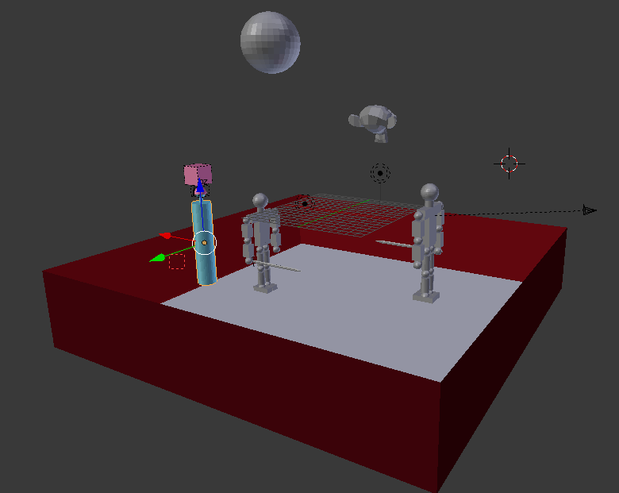

<h1 style="text-align: center;">Práctica 6</h1>

## Introducción
El objetivo de esta práctica es crear un entorno virtual integrando los trabajos realizados en las prácticas anteriores.

## Desarrollo de la práctica
Respecto a la práctica previa solo era necesario incluir algún modelo con texturas, por lo que he importado la espada con texturas de la práctica 3 y he tenido que recrear el humanoide actor (porque sus partes estaban unidas) a partir del modelo de la práctica 4 sustituyendo su espada por la espada con texturas y realizando todo el proceso descrito en la práctica 5 para que se mueva e interaccione con el resto de objetos de manera consistente.

## Resultado final
Voy a recordar todos los movimientos implementados en el actor así como sus controles a modo de resumen del entorno virtual

<table>
  <thead>
    <tr>
      <th>Movimiento</th>
      <th class="control">Control</th>
    </tr>
  </thead>
  <tbody>
    <tr>
      <td>Mover todo el avatar hacia delante</td>
      <td class="control">Up Arrow</td>
    </tr>
    <tr>
      <td>Mover todo el avatar hacia detrás</td>
      <td class="control">Down Arrow</td>
    </tr>
    <tr>
      <td>Rotar el avatar hacia la derecha</td>
      <td class="control">Right Arrow</td>
    </tr>
    <tr>
      <td>Rotar el avatar hacia la izquierda</td>
      <td class="control">Left Arrow</td>
    </tr>
    <tr>
      <td>Mover la cámara</td>
      <td class="control">Ratón</td>
    </tr>
    <tr>
      <td>Mover la pierna derecha hacia delante</td>
      <td class="control">S</td>
    </tr>
    <tr>
      <td>Mover la pierna derecha hacia detrás</td>
      <td class="control">W</td>
    </tr>
    <tr>
      <td>Mover la pierna izquierda hacia delante</td>
      <td class="control">D</td>
    </tr>
    <tr>
      <td>Mover la pierna izquierda hacia detrás</td>
      <td class="control">E</td>
    </tr>
    <tr>
      <td>Mover el brazo derecho hacia delante</td>
      <td class="control">K</td>
    </tr>
    <tr>
      <td>Mover el brazo derecho hacia detrás</td>
      <td class="control">I</td>
    </tr>
    <tr>
      <td>Mover el brazo izquierdo hacia delante</td>
      <td class="control">L</td>
    </tr>
    <tr>
      <td>Mover el brazo izquierdo hacia delante</td>
      <td class="control">O</td>
    </tr>
  </tbody>
</table>

